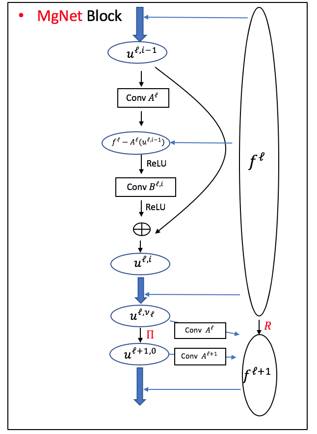

# MgNet: A Unified Framework of Multigrid and Convolutional Neural Network
This repository contains the [PyTorch](https://pytorch.org/) (1.7.1) implementation of MgNet. 

As an example, the following command trains a MgNet with  on CIFAR-100:

`python mgnet_train.py --wise-B --dataset cifar100`

### Introduction

MgNet is a unified model that simultaneously recovers some convolutional neural networks (CNN) for image classification and multigrid (MG) methods for solving discretized partial differential equations (PDEs). Here is a diagram of its architecture.



For simplicity, we use the following notation to represent different MgNet models with different hyper-parameters: 

<a href="https://www.codecogs.com/eqnedit.php?latex={\rm&space;MgNet}[\nu_1,\cdots,\nu_J]\text{-}[(c_{u,1},&space;c_{f,1}),&space;\cdots,&space;(c_{u,J},&space;c_{f,J})]\text{-}B^{\ell,i}" target="_blank"></a>

These hyper-parameters are defined as follows. 

1. : The number of smoothing iterations on each grid. For example, [2,2,2,2] means that there are 4 grids, and the number of iterations of each grid is 2.
2. : The number of channels for  and  on each grid. We mainly consider the case , which suggests us the following simplification notation , or even [c] if we further take . For examples,  and .
3. : This means that we use different smoother  in each smoothing iteration. Correspondingly,  means that we share the smoother among each grid, which is  

Here we mention that we always use , which only depends on grids. For example, the following notation  denotes a MgNet model which adopts 4 different grids (feature resolutions), 2 smoothing iterations on each grid, 256 channels for both feature tensor  and data tensor , and smoothing iteration . 

### Results on CIFAR and ImageNet

#### **Jianqing, please add Table 4 in linear model paper here.** 

Model                    | Parameters | CIFAR-10 | CIFAR100
-----                       | -----           | -----        |  ------
MgNet[2,2,2,2],256,B^{l} |  8.3M          | 96.00       | 79.94


### Citation

For more detials about MgNet, we refer to the following two papers. If you also find MgNet useful in your research, please consider citing:

```
@article{he2019mgnet,
  title={MgNet: A unified framework of multigrid and convolutional neural network},
  author={He, Juncai and Xu, Jinchao},
  journal={Science china mathematics},
  volume={62},
  number={7},
  pages={1331--1354},
  year={2019},
  publisher={Springer}
}

@article{he2019constrained,
  title={Constrained Linear Data-feature Mapping for Image Classification},
  author={He, Juncai and Chen, Yuyan and Zhang, Lian and Xu, Jinchao},
  journal={arXiv preprint arXiv:1911.10428},
  year={2019}
}
```

### Contact

jhe AT utexas.edu

xu AT math.psu.edu

zhanglian AT multigrid.org

jqzhu AT emails.bjut.edu.cn

Any discussions, comments, suggestions and questions are welcome!

